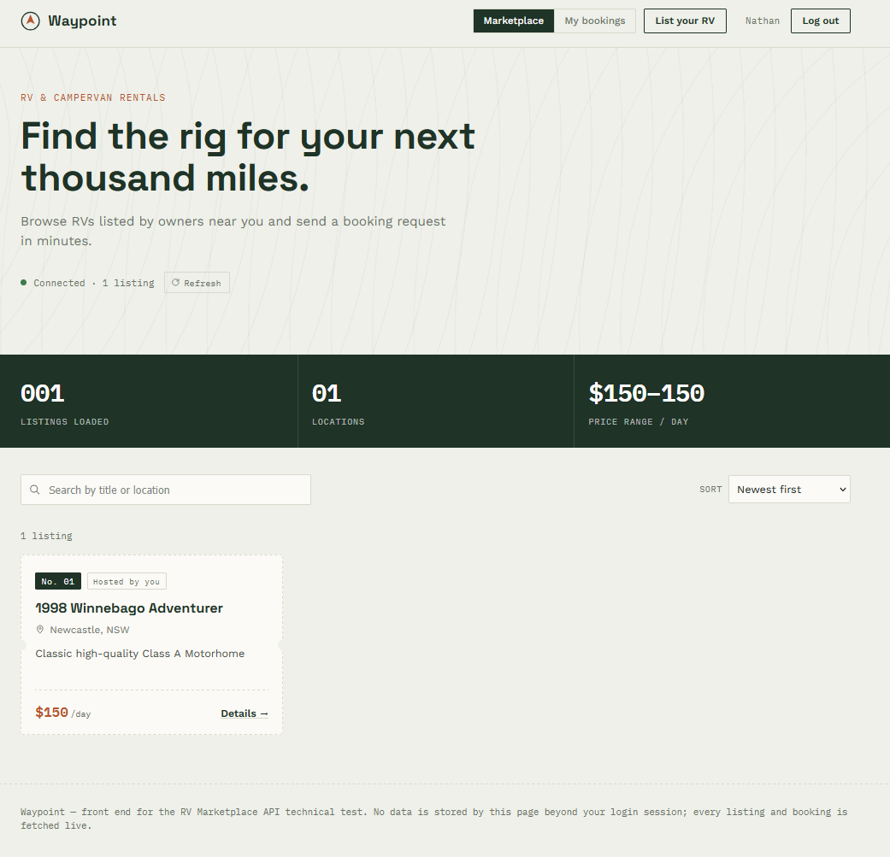

# RV Marketplace API

A RESTful API for a two-sided RV rental marketplace built with Ruby on Rails. Connects RV owners (lessors) with renters (hirers) for listing management, lead generation, messaging, and booking requests.

## Frontend Preview



## Quick Start

**Docker (recommended):** No local Ruby or PostgreSQL needed — see [Docker](#docker) below.

**Local:** Requires Ruby 3.3.11 and PostgreSQL 12+ — see [Setup](#setup) below.

## Requirements

- Ruby 3.3.11
- Rails 8.1.3
- PostgreSQL 12+
- Bundler

## Setup

1. **Clone the repository**
   ```bash
   git clone <repo-url>
   cd rv-marketplace-api
   ```

2. **Install dependencies**
   ```bash
   bundle install
   ```

3. **Configure environment variables**
   ```bash
   cp .env.example .env
   ```
   Edit `.env` with your local database credentials and secrets.

4. **Create and migrate the database**
   ```bash
   bundle exec rails db:create
   bundle exec rails db:migrate
   ```

5. **Start the server**
   ```bash
   bundle exec rails s
   ```

Once running:

| URL | Description |
|-----|-------------|
| `http://localhost:3000/listings` | API — list all RV listings |
| `http://localhost:3000/api-docs` | Interactive Swagger documentation |
| `http://localhost:3000/frontend/index.html` | Frontend UI |

## Environment Variables

| Variable | Required | Description |
|----------|----------|-------------|
| `DATABASE_URL` | Yes | PostgreSQL connection URL |
| `JWT_SECRET` | Yes | Secret for signing JWT tokens. Generate with `bundle exec rails secret` |
| `SECRET_KEY_BASE` | Production only | Rails secret key base. Generate with `bundle exec rails secret` |

## API Endpoints

### Authentication
- `POST /register` — Register a new user
- `POST /login` — Login and receive a JWT token

### Listings
- `GET /listings` — List all RV listings
- `GET /listings/:id` — Show a single listing
- `POST /listings` — Create a new listing (authenticated)
- `PUT/PATCH /listings/:id` — Update a listing (owner only)
- `DELETE /listings/:id` — Delete a listing (owner only)

### Bookings
- `POST /listings/:listing_id/bookings` — Create a booking request (authenticated)
- `GET /bookings` — List user's bookings (as hirer or owner)
- `PATCH /bookings/:id/confirm` — Confirm a booking (owner only)
- `PATCH /bookings/:id/reject` — Reject a booking (owner only)

### Messages
- `GET /listings/:listing_id/messages` — List messages for a listing (authenticated)
- `POST /listings/:listing_id/messages` — Send a message on a listing (authenticated)

Any authenticated user can send and view messages on a listing.

## Authentication

Token-based authentication via JWT. After registering or logging in, include the token in the `Authorization` header:
```
Authorization: Bearer <token>
```

Tokens expire after 24 hours.

## Testing

Run the test suite:
```bash
bundle exec rspec
```

## API Documentation

Interactive Swagger UI is available at `http://localhost:3000/api-docs` once the server is running.

To regenerate the OpenAPI spec from the RSpec tests:
```bash
bundle exec rake rswag:specs:swaggerize
```

## Docker

A `Dockerfile` (production, multi-stage) and `docker-compose.yml` are included.

### Quick start

1. **Copy and fill in secrets**
   ```bash
   cp .env.example .env
   ```
   Fill in `SECRET_KEY_BASE` and `JWT_SECRET` — generate values with `bundle exec rails secret`.

2. **Build and start**
   ```bash
   docker compose up --build
   ```
   The database is created and migrated automatically on first boot.

3. **Stop**
   ```bash
   docker compose down        # keep data
   docker compose down -v     # remove data volumes too
   ```

Once running, the same URLs apply:

| URL | Description |
|-----|-------------|
| `http://localhost:3000/listings` | API |
| `http://localhost:3000/api-docs` | Swagger UI |
| `http://localhost:3000/frontend/index.html` | Frontend UI |

### Services

| Service | Image | Port |
|---------|-------|------|
| `web` | Built from local `Dockerfile` | `3000 → 80` |
| `db` | `postgres:16-alpine` | internal only |

## Development

- Linting: `bundle exec rubocop`
- Security audit: `bundle exec brakeman`
- Dependency audit: `bundle exec bundler-audit`
